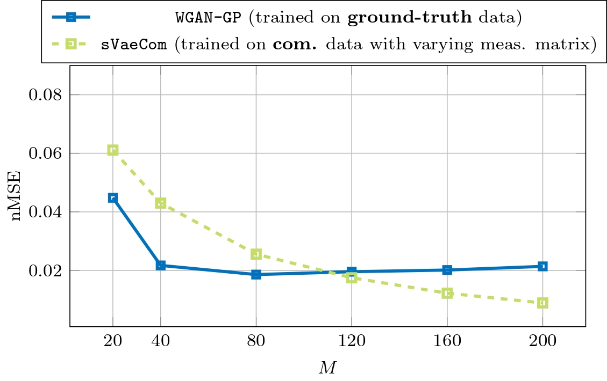
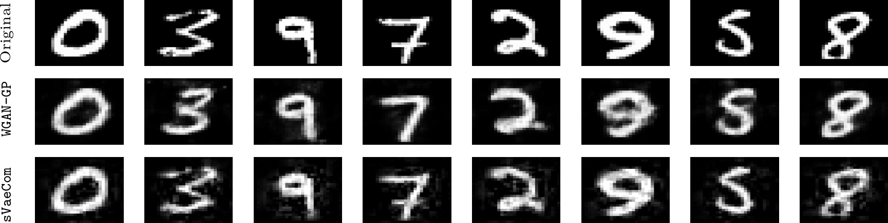
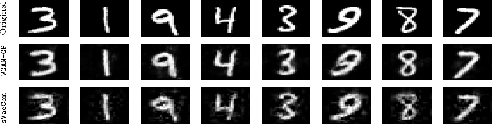
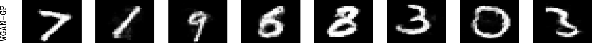
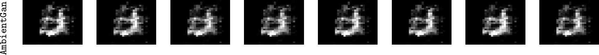
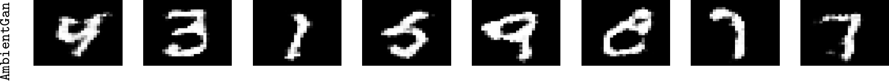

### The following results are preliminary and will be updated regularly 

--- 

### Comparison with CK-SVD

---

Figure 1: Performance comparison with CK-SVD [1,2] with sparsity levels 2, 4 and 8 (288 dictionary atoms). CK-SVD has been trained on measurements from varying measurement matrices for every training sample, respectively. Our proposed models (sVaeCom & sVaeGmm) have been trained on measurements from one fixed measurement matrix.All trainable models have been trained on a training set of 10000 compressed and noisy piecewise function with an SNR of 10dB. The observation dimension is M and the piecewise smooth functions have a dimension of 256.

---

Figure 2: Performance comparison with CK-SVD [1,2] with sparsity levels 4 and 8 (288 dictionary atoms). CK-SVD as well as our proposed models (sVaeCom & sVaeGmm) have been  trained on measurements from one fixed measurement matrix. All trainable models have been trained on a training set of 10000 compressed and noisy piecewise function with an SNR of 10dB. The observation dimension is M and the piecewise smooth functions have a dimension of 256.

---

Figure 3: Performance comparison with CK-SVD [1,2] with sparsity levels 4 and 8 (128 dictionary atoms). CK-SVD has been trained on measurements from varying measurement matrices for every training sample, respectively. We evaluated our proposed model sVaeCom with a fixed measurement matrix and with varying measurement matrices, respectively. 
All trainable models have been trained on a training set of 5000 compressed MNIST images. The observation dimension is M and the MNIST images have a dimension of 784. (The simulations for CK-SVD4 for M = 200 have not finished yet.)

---

### Evaluation on CelebA

---

Figure 4: Performance of sVaeCom trained on a training set of 1000 compressed grayscaled celebA 64 × 64 (i.e., N = 4096), which were cropped and centered. The model has been trained on measurements from varying measurement matrices for every training sample, respectively. It is compared with Lasso, whose hyperparameter is tuned based on a ground-truth dataset. The measurement dimension is M.

---

Figure 5: Exemplary reconstructed images from the grayscaled celebA dataset. sVaeCom has been
trained on solely 1000 compressed training samples. The measurement dimension M equals 512.
The images have a dimension of 4096. The hyperparameter of Lasso has been tuned on a ground
truth dataset.

---

Figure 6: Exemplary reconstructed images from the grayscaled celebA dataset. sVaeCom has been
trained on solely 1000 compressed training samples. The measurement dimension M equals 1024.
The images have a dimension of 4096. The hyperparameter of Lasso has been tuned on a ground
truth dataset.

---

### Comparison with the GAN and AmbientGAN (updated 4 April 2024)

---

To evaluate the proper training of the GANs, we plotted generated MNIST images with the GAN trained on ground truth data (Fig. 10), with the AmbientGAN trained on compressed data with Gaussian measurement matrices (Fig. 11), and with the AmbientGAN trained on compressed data with masked pixels (Fig. 12). Moreover, we added a detailed description of the GAN models and the compressive sensing reconstruction at the very end.

---

Figure 7: Reconstruction performance comparison between
1) sVaeCom trained on a training set of 5000 **compressed** MNIST images with 
2) a WassersteinGan with gradient penality trained on 5000 **ground truth** images.

The compressed MNIST images were generated by varying Gaussian measurement matrices with measurement dimension M.

For M > 120, our model outperforms the GAN trained on ground truth data in terms of the distortion based normalized MSE metric. In general, if the range of the GAN captures natural MNIST images properly during training, then any GAN-based reconstruction is ensured to output a natural MNIST digit.
Therefore, although our model outperforms the GAN for M >= 120 in terms of the nMSE, perceptually both perform arguably similar for M = 200 (see Fig. 8) and for M = 120, the GAN is perceptually better (see Fig. 9). While our model recovers the details of the compressed MNIST image, the GAN emphasizes the perceptual quality of the image.
Due to the mismatch in the training data (our model learns from compressed data of dimension M, whereas the GAN can access ground truth data), the comparison in these simulations is informative but rather unfair.

---

Figure 8: Exemplary reconstructed images from MNIST for M = 200 with

the GAN trained on ground truth data and

the sVaeCom trained on compressed data.

---

Figure 9: Exemplary reconstructed images from MNIST for M = 120 with

the GAN trained on ground truth data and

the sVaeCom trained on compressed data.

---

A fair comparison is to compare with the AmbientGAN [3] trained on compressed data generated by varying Gaussian measurement matrices. However, up to now, we could not sucessfully train an AmbientGAN with compressed data from Gaussian measurement matrices (see Fig. 11 for the generated MNIST images of this AmbientGAN). This is in line with [3], which observes severe performance degredation, when the measurement matrix is constructed from 1D (Gaussian) projections (see Figure 5(b) and "Section 8 - Failure Case" in [3]). It should be noted that these measurement matrices are those, which are used for our model sVaeCom for comparison with the GAN trained on ground truth data in Fig. 7-9.

---

Figure 10: Generated MNIST images with the GAN trained on ground truth data.

---

Figure 11: Generated MNIST images with the AmbientGAN trained on compressed data with Gaussian measurement matrices. The training failed.

---

Figure 12: Generated MNIST images with the AmbientGAN trained on compressed data with measurement matrices, which randomly mask out half of the pixels. The perceptual quality roughly matches the one in [3], which generated MNIST images in the same setting in Fig. 11 (fourth column, second row).

---

References:

[1] F. Pourkamali Anaraki and S. M. Hughes, “Compressive k-svd,” in 2013
IEEE International Conference on Acoustics, Speech and Signal Processing,
2013, pp. 5469–5473.

[2] F. Pourkamali-Anaraki, S. Becker, and S. M. Hughes, “Efficient dictionary
learning via very sparse random projections,” in 2015 International Confer-
ence on Sampling Theory and Applications (SampTA), 2015, pp. 478–482.

[3] A. Bora, E. Price, and A. G. Dimakis, “AmbientGAN: Generative models from lossy measurements,” in Int. Conf. on Learning Representations, 2018.

