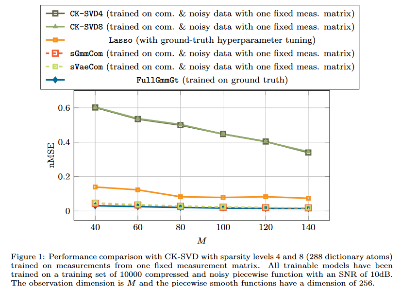
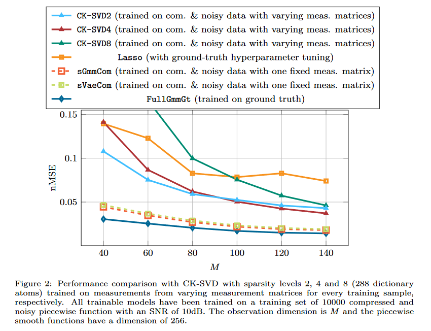

1) Comparison with CK-SVD on piecewise smooth functions, where CK-SVD and our model both use one fixed measurement matrix for the whole training/validation/test set. (The baselines Lasso and FullGmmGt are kept)

