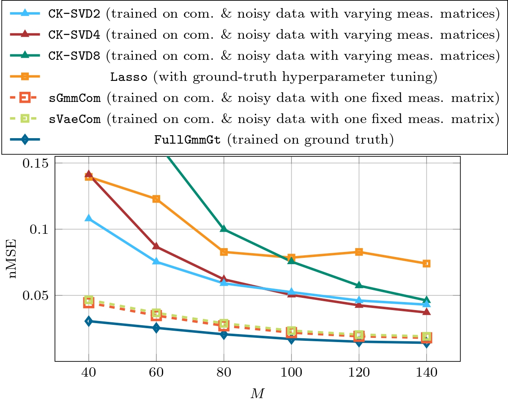
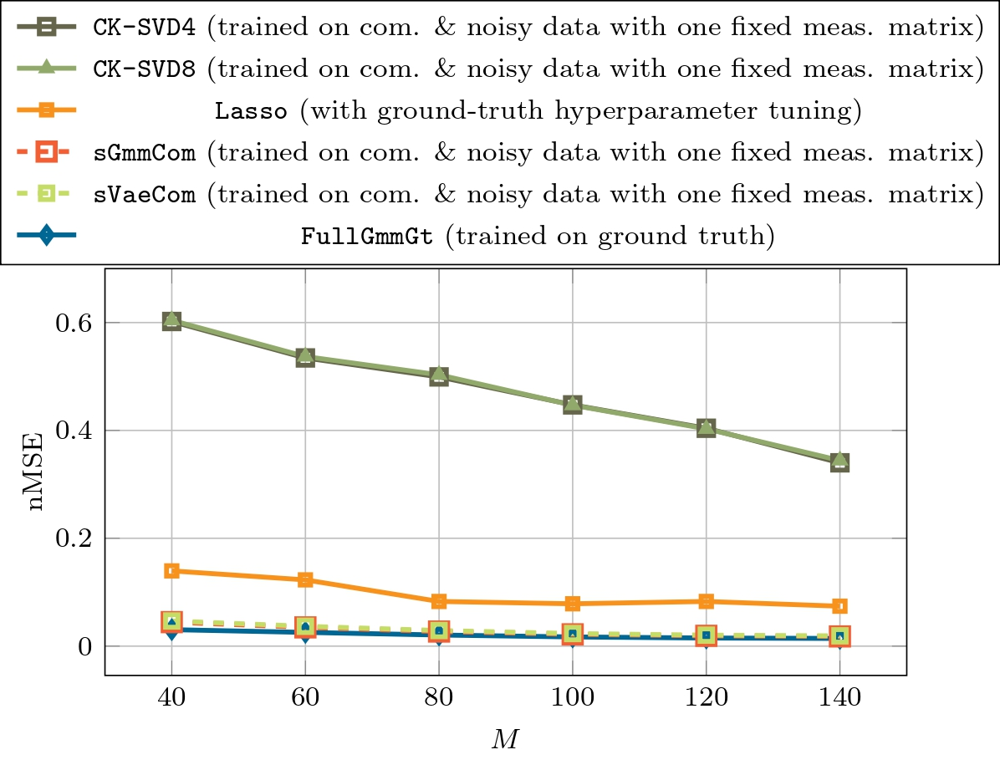
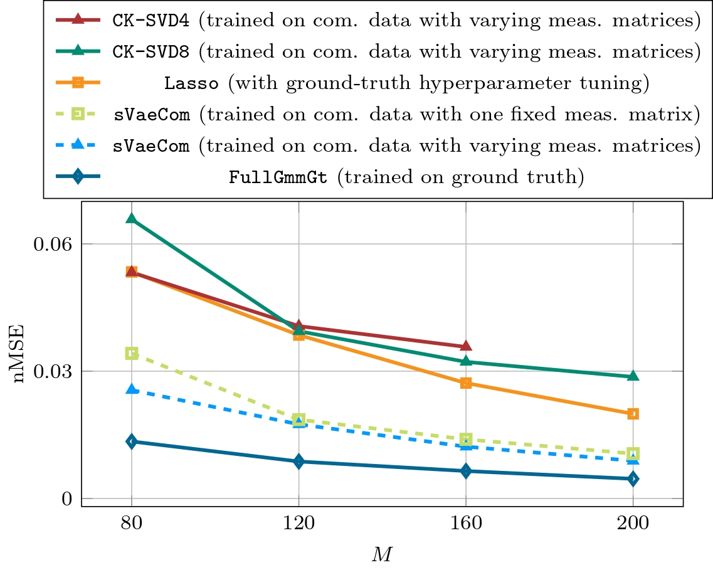
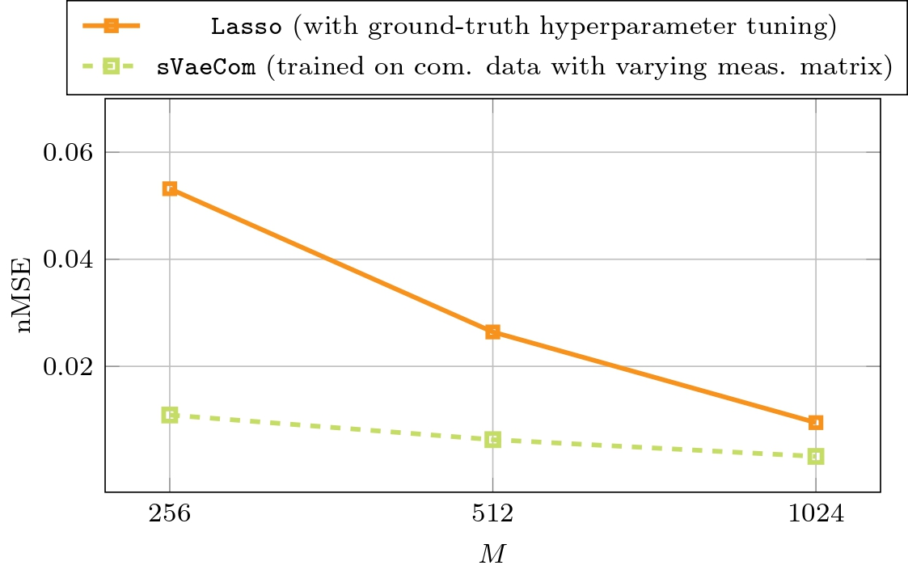
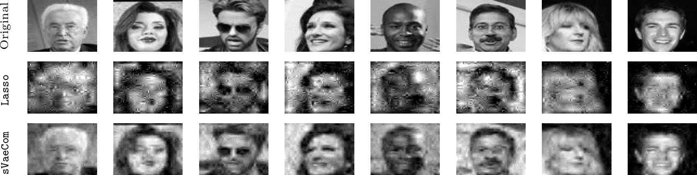
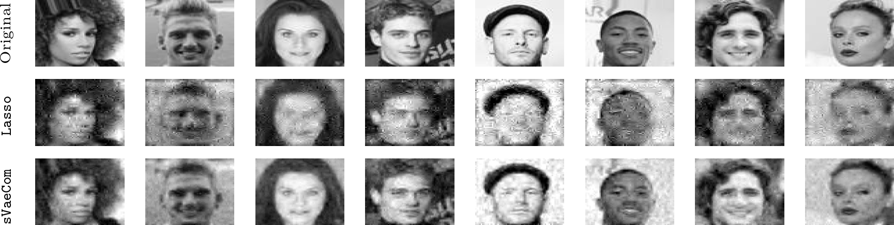

### The following results are preliminary and will be updated regularly 

---

### Comparison with the GAN and AmbientGAN (updated 4 April 2024)

---

### Comparison with CK-SVD

---

Figure 1: Performance comparison with CK-SVD [1,2] with sparsity levels 2, 4 and 8 (288 dictionary atoms). CK-SVD has been trained on measurements from varying measurement matrices for every training sample, respectively. Our proposed models (sVaeCom & sVaeGmm) have been trained on measurements from one fixed measurement matrix.All trainable models have been trained on a training set of 10000 compressed and noisy piecewise function with an SNR of 10dB. The observation dimension is M and the piecewise smooth functions have a dimension of 256.

---

Figure 2: Performance comparison with CK-SVD [1,2] with sparsity levels 4 and 8 (288 dictionary atoms). CK-SVD as well as our proposed models (sVaeCom & sVaeGmm) have been  trained on measurements from one fixed measurement matrix. All trainable models have been trained on a training set of 10000 compressed and noisy piecewise function with an SNR of 10dB. The observation dimension is M and the piecewise smooth functions have a dimension of 256.

---

Figure 3: Performance comparison with CK-SVD [1,2] with sparsity levels 4 and 8 (128 dictionary atoms). CK-SVD has been trained on measurements from varying measurement matrices for every training sample, respectively. We evaluated our proposed model sVaeCom with a fixed measurement matrix and with varying measurement matrices, respectively. 
All trainable models have been trained on a training set of 5000 compressed MNIST images. The observation dimension is M and the MNIST images have a dimension of 784. (The simulations for CK-SVD4 for M = 200 have not finished yet.)

---

### Evaluation on CelebA

---

Figure 4: Performance of sVaeCom trained on a training set of 1000 compressed grayscaled celebA 64 × 64 (i.e., N = 4096), which were cropped and centered. The model has been trained on measurements from varying measurement matrices for every training sample, respectively. It is compared with Lasso, whose hyperparameter is tuned based on a ground-truth dataset. The measurement dimension is M.

---

Figure 5: Exemplary reconstructed images from the grayscaled celebA dataset. sVaeCom has been
trained on solely 1000 compressed training samples. The measurement dimension M equals 512.
The images have a dimension of 4096. The hyperparameter of Lasso has been tuned on a ground
truth dataset.

---

Figure 6: Exemplary reconstructed images from the grayscaled celebA dataset. sVaeCom has been
trained on solely 1000 compressed training samples. The measurement dimension M equals 1024.
The images have a dimension of 4096. The hyperparameter of Lasso has been tuned on a ground
truth dataset.

---

References:

[1] F. Pourkamali Anaraki and S. M. Hughes, “Compressive k-svd,” in 2013
IEEE International Conference on Acoustics, Speech and Signal Processing,
2013, pp. 5469–5473.

[2] F. Pourkamali-Anaraki, S. Becker, and S. M. Hughes, “Efficient dictionary
learning via very sparse random projections,” in 2015 International Confer-
ence on Sampling Theory and Applications (SampTA), 2015, pp. 478–482.
